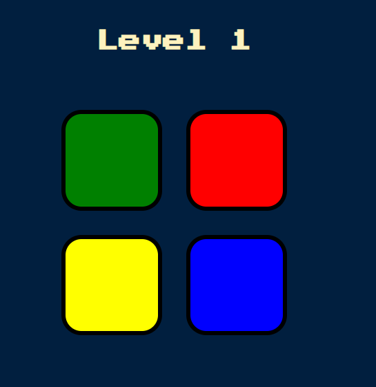
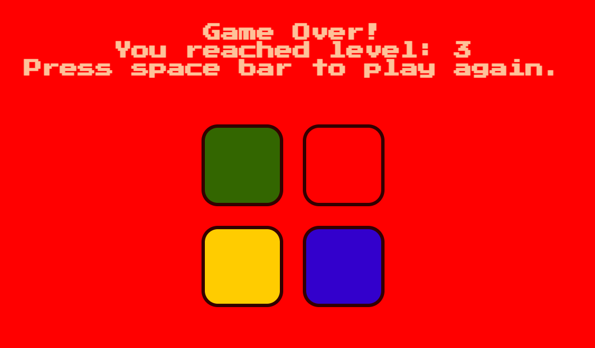

# Simon Game

## Project Overview
This project is an implementation of the classic Simon game using HTML, CSS, and JavaScript. Test your memory in this challenge to remember and repeat a growing sequence of colors and sounds.

Game Start


Level 1



Game Over!



## How to Run This Project Locally

To run this Simon Game on your local machine, follow these steps:

##### 1. **Clone the repository**
   Open your terminal and run the following command:
```
git clone https://github.com/your-username/js-drum-app.git
```
Replace `your-username` with your actual GitHub username.

##### 2. **Navigate to the project directory**
```
cd simon-game
```

##### 3. **Open the project in your code editor**
If you're using Visual Studio Code, you can open the project with:
``` 
code .
```
##### 4. Directly opening the HTML file:
   Simply double-click the `index.html` file in your file explorer, and it should open in your default web browser.

##### 5. **Play the game!**
The game should now be running in your web browser. Press any key to start and enjoy!

## What I Learned

### 1. DOM Manipulation with JavaScript and jQuery
I learned how to dynamically update the content of HTML elements without reloading the page. This is achieved by using JavaScript and jQuery to target specific elements by their class or ID and modify their content.

Example:
```javascript
$("#level-title").text("Level " + level);
```

This line changes the text of the element with the ID "level-title" to display the current level.
### 2. Event Handling
I gained experience in handling various user interactions such as button clicks and keypresses:

```
$(document).on("keydown", function() {
    // Code to start or restart the game
});

$(".btn").click(function() {
    // Code to handle button clicks during the game
});
```

### 3. Audio and Visual Feedback
I learned how to provide audio and visual feedback to enhance user experience:
```
function playSound(name) {
    var audio = new Audio("sounds/" + name + ".mp3");
    audio.play();
}

function animatePress(currentColor) {
    $("#" + currentColor).addClass("pressed");
    setTimeout(function () {
        $("#" + currentColor).removeClass("pressed");
    }, 100);
}
```

### 4. Game Logic Implementation
I implemented the core game logic, including sequence generation, user input validation, and game state management.
### 5. Asynchronous Programming
I used setTimeout() and promises to handle timing and sequencing of game events:
```
setTimeout(function() {
    nextSequence();
}, 1000);
```

### How JavaScript Enables Dynamic Text Replacement
JavaScript allows for dynamic manipulation of the Document Object Model (DOM), which represents the structure of the HTML document. By using methods like getElementById(), querySelector(), or jQuery selectors, we can target specific elements on the page.
Once an element is selected, its content can be changed using properties like textContent, innerHTML, or jQuery methods like .text() and .html().
For example:
```
$("#level-title").text("Game Over! Press Any Key to Restart");
```
This line instantly updates the text displayed in the element with ID "level-title" without needing to reload the entire page. This creates a smoother, more responsive user experience, as only the necessary parts of the page are updated.
This technique is fundamental in creating interactive web applications, allowing for real-time updates and dynamic content changes based on user actions or game state, all without the need for page reloads.

### Acknowledgements
The HTML & CSS code was provided as an exercise by Dr. Angela Yu from her Udemy Course: The Complete 2024 Web Development Bootcamp
